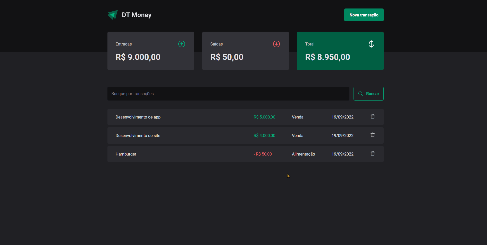

## PORTUGUÊS
# DT Money
* [GIF](#GIF)
* [FEITO COM](#FEITO-COM)
* [FUNCIONALIDADES](#FUNCIONALIDADES)
* [COMO TESTAR](#COMO-TESTAR)

## ENGLISH
# DT Money
* [GIF](#GIF)
* [MADE WITH](#MADE-WITH)
* [FEATURES](#FEATURES)
* [HOW TO TEST](#HOW-TO-TEST)

# GIF

### FEITO COM
<ul>
<li>React</li>
<li>Typescript</li>
<li>Styled Components</li>
<li>HTML5</li>
<li>CSS3</li>
</ul>
 
 

### FUNCIONALIDADES
<ul>
<li>Adicionar entrada/saida.</li>
<li>Listagem entrada/saida.</li>
<li>Filtro de busca.</li>
<li>Mostrar os valores de entradas, saidas e total.</li>
<li>Deletar.</li>
</ul>
 
 

### COMO RODAR A APLICAÇÃO
1. No terminal, clone o projeto:
<pre>
git clone https://github.com/andr3felipe/DT-Money.git
</pre>
2. Entre na pasta do projeto:
<pre>
cd DT-Money
</pre>
3. Instale as dependências:
<pre>
npm install
</pre>
4. Execute a aplicação:
<pre>
npm run dev
</pre>
5. Para rodar o servidor abra um novo terminal e navegue novamente até a pasta <strong>DT-Money</strong> repetindo o passo 2.
- 
Execute o server:

<pre>
npm run dev:server
</pre>

## ENGLISH

### MADE WITH
<ul>
<li>React</li>
<li>Typescript</li>
<li>Styled Components</li>
<li>HTML5</li>
<li>CSS3</li>
</ul>
 
 

### FEATURES
<ul>
<li>Add income/expenses.</li>
<li>List income/expenses.</li>
<li>Search filter.</li>
<li>Show income, expenses and total value.</li>
<li>Delete.</li>
</ul>
 
 

### HOW TO TEST
1. On the terminal, clone the project:
<pre>
git clone https://github.com/andr3felipe/DT-Money.git
</pre>
2. Go to project folder:
<pre>
cd DT-Money
</pre>
3. Install dependencies:
<pre>
npm install
</pre>
4. Run the application:
<pre>
npm run dev
</pre>
5. To run the server, open a new terminal and go to the project folder <strong>DT-Money</strong> repeating the step 2.
- 
Run the server:

<pre>
npm run dev:server
</pre>

